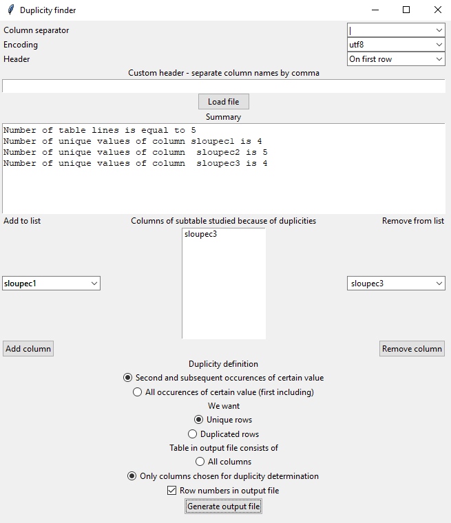

# Program for finding unique/duplicate values 
The program is used for finding either unique or duplicate entries in a csv-like file. Character separating individual columns in that file can be not only column, but also a period, space, slash etc. The program can work even if csv-file is missing header or the header is somehow corrupted.
Firstly an user have to choose the separator, the encoding (default utf-8) and header (its location, if it is custom etc.). Afterwards the button "Load file" is used to choose examined file and short report appears in the text field. In the combobox below user can select which columns should be searched for duplicate values. Then it can be set whether the "duplicate record" refers to the second occurrence (and other occurrences) of a record that was previously in the column, or even the first occurrence of the record. Finally, it can be chosen whether user want to know unique or duplicate lines, and by clicking the button at the very bottom, the resulting file with unique / duplicates is created in the same directory as the python program.
User can test functionality with files located in example_data folder.

### History\
18. 11. 18 - first version\
20. 11. 18 - support for space as separator; support for non-existing header; more user-friendly interface\
21. 11. 18 - the choice of encoding added\
25. 11. 18 - info to user that the file has been saved + refactoring (both by Miloslav Létal); added option to remove rows numbering (+ rows are counted from 1 and not from 0 as previously); list of columns which are searched for duplicities is not in combobox but in listbox\
31. 12. 18 - option for having either all columns or only columns used for duplicity search in report file\
20. 10. 19 - refactoring; transition from Czech to English (with exception of the readme)
26. 10. 19 - tests added; readme translation